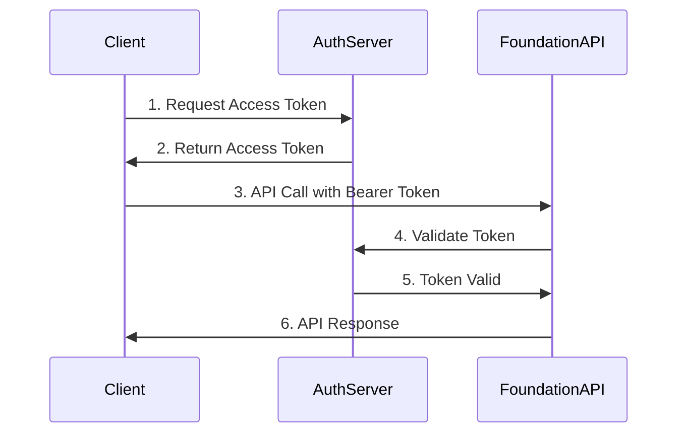

# APIs y Endpoints - SURA Foundation Framework

## Resumen Ejecutivo

Este documento describe las APIs, endpoints y métodos de integración disponibles en **SURA Foundation Framework**. El framework expone servicios REST, métodos Apex invocables, y Integration Procedures para facilitar la integración con sistemas externos y componentes de Vlocity/OmniStudio.

---

## 🏗️ Arquitectura de APIs

### Principios de Diseño

1. **RESTful**: Seguimiento de estándares REST para APIs HTTP
2. **Versionado**: Control de versiones para compatibilidad
3. **Seguridad**: Autenticación y autorización robusta
4. **Observabilidad**: Logging completo de requests/responses
5. **Resiliencia**: Manejo de errores y reintentos configurables

```
┌─────────────────────────────────────────────────────────────────┐
│                    FOUNDATION API ARCHITECTURE                 │
│                                                                 │
│  ┌─────────────┐    ┌─────────────┐    ┌─────────────────────┐ │
│  │   External  │    │  Vlocity    │    │    Internal         │ │
│  │   Systems   │    │ Components  │    │   Processes         │ │
│  │             │    │             │    │                     │ │
│  └──────┬──────┘    └──────┬──────┘    └──────┬──────────────┘ │
│         │                  │                  │                │
│         │ REST APIs        │ Apex Methods     │ Platform Events │
│         │                  │                  │                │
│         ▼                  ▼                  ▼                │
│  ┌─────────────────────────────────────────────────────────────┐ │
│  │              SURA FOUNDATION CORE                          │ │
│  │                                                             │ │
│  │  ┌─────────────┐ ┌─────────────┐ ┌─────────────────────┐   │ │
│  │  │   API       │ │ Integration │ │     Event           │   │ │
│  │  │  Gateway    │ │ Procedures  │ │   Management        │   │ │
│  │  └─────────────┘ └─────────────┘ └─────────────────────┘   │ │
│  └─────────────────────────────────────────────────────────────┘ │
└─────────────────────────────────────────────────────────────────┘
```

---

## 🌐 REST APIs

### Base URL y Versionado

**Base URL:** `/services/apexrest/sura/foundation/v1/`

**Estructura de Endpoints:**
```
https://{instance}.salesforce.com/services/apexrest/sura/foundation/v1/{resource}
```

### Autenticación

**Métodos Soportados:**
- OAuth 2.0 (Recomendado)
- Session ID
- Connected Apps

**Headers Requeridos:**
```http
Authorization: Bearer {access_token}
Content-Type: application/json
Accept: application/json
X-SURA-API-Version: v1
```

---

## 📋 Endpoints Principales

### 1. Process Management APIs

#### POST /process/execute
**Propósito:** Ejecutar un proceso específico del framework

**Request:**
```http
POST /services/apexrest/sura/foundation/v1/process/execute
Content-Type: application/json

{
  "processName": "LeadKnowing",
  "productFamily": "Seguros de Motos",
  "stage": "Conocimiento",
  "recordId": "00Q000000123456",
  "parameters": {
    "vehicleType": "Moto",
    "engine": "150CC",
    "model": "2024",
    "validateRUNT": true
  },
  "executeAsync": false
}
```

**Response:**
```json
{
  "success": true,
  "processExecutionId": "a0X000000123456",
  "status": "Completed",
  "duration": 1250,
  "result": {
    "processedRecords": 1,
    "validationsPassed": true,
    "integrationsCalled": ["RUNT", "FASECOLDA"],
    "nextStage": "Tarificación"
  },
  "errors": [],
  "warnings": [
    {
      "code": "WARN_001",
      "message": "Vehículo no encontrado en FASECOLDA, usando valores por defecto"
    }
  ]
}
```

#### GET /process/status/{executionId}
**Propósito:** Consultar el estado de una ejecución

**Response:**
```json
{
  "executionId": "a0X000000123456",
  "status": "Running",
  "progress": 75,
  "startTime": "2025-05-23T10:30:00Z",
  "estimatedCompletion": "2025-05-23T10:32:30Z",
  "currentPhase": "In",
  "processedSteps": [
    {
      "stepName": "Validation",
      "status": "Completed",
      "duration": 150
    },
    {
      "stepName": "Integration",
      "status": "Running",
      "duration": 0
    }
  ]
}
```

### 2. Integration APIs

#### POST /integration/external/call
**Propósito:** Realizar llamadas a servicios externos con retry logic

**Request:**
```http
POST /services/apexrest/sura/foundation/v1/integration/external/call
Content-Type: application/json

{
  "serviceName": "RUNT_VehicleConsultation",
  "endpoint": "/api/vehicles/lookup",
  "method": "POST",
  "headers": {
    "X-API-Key": "encrypted_key",
    "Content-Type": "application/json"
  },
  "payload": {
    "plate": "ABC123",
    "documentType": "CC",
    "documentNumber": "12345678"
  },
  "retryConfig": {
    "maxRetries": 3,
    "retryPattern": "Fibonacci",
    "retryOnCodes": [500, 502, 503, 504]
  }
}
```

**Response:**
```json
{
  "integrationId": "IL-000123",
  "success": true,
  "httpStatus": 200,
  "duration": 850,
  "retryAttempts": 0,
  "response": {
    "vehicleFound": true,
    "vehicleData": {
      "brand": "YAMAHA",
      "model": "YBR 125",
      "year": 2023,
      "engine": "125CC",
      "fasecolda": "123456"
    }
  }
}
```

### 3. Event Management APIs

#### POST /events/publish
**Propósito:** Publicar eventos en el sistema

**Request:**
```json
{
  "eventType": "ProcessCompleted",
  "category": "Business",
  "recordId": "00Q000000123456",
  "payload": {
    "processName": "LeadKnowing",
    "stage": "Conocimiento",
    "result": "Success",
    "nextActions": ["StartRating"]
  },
  "publishAsync": true
}
```

#### GET /events/history/{recordId}
**Propósito:** Obtener historial de eventos de un registro

**Response:**
```json
{
  "recordId": "00Q000000123456",
  "totalEvents": 15,
  "events": [
    {
      "eventId": "EL-000456",
      "eventType": "ProcessStarted",
      "timestamp": "2025-05-23T10:30:00Z",
      "processName": "LeadKnowing",
      "status": "Success",
      "duration": 150
    },
    {
      "eventId": "EL-000457",
      "eventType": "IntegrationCalled",
      "timestamp": "2025-05-23T10:30:05Z",
      "serviceName": "RUNT",
      "status": "Success",
      "duration": 850
    }
  ]
}
```

### 4. Configuration APIs

#### GET /config/processes
**Propósito:** Obtener configuración de procesos

**Response:**
```json
{
  "processes": [
    {
      "developerName": "Lead_Motos_Conocimiento",
      "productFamily": "Seguros de Motos",
      "stage": "Conocimiento",
      "handlerClass": "MT_Kn_123",
      "isActive": true,
      "order": 0,
      "configuration": {
        "validateRUNT": true,
        "requireFasecolda": true
      }
    }
  ]
}
```

#### PUT /config/feature-flags/{flagName}
**Propósito:** Actualizar feature flags

**Request:**
```json
{
  "isEnabled": true,
  "environment": "Production",
  "effectiveDate": "2025-06-01",
  "configuration": {
    "rolloutPercentage": 50
  }
}
```

---

## ⚡ Métodos Apex Invocables

### 1. ProcessExecutor
**Propósito:** Ejecutar procesos desde Flows o Process Builder

```apex
@InvocableMethod(
  label='Execute Foundation Process'
  description='Executes a Foundation framework process'
)
public static List<ProcessResult> executeProcess(List<ProcessRequest> requests)
```

**Input:**
```apex
public class ProcessRequest {
  @InvocableVariable(required=true)
  public String processName;
  
  @InvocableVariable(required=true)
  public String productFamily;
  
  @InvocableVariable(required=true)
  public String recordId;
  
  @InvocableVariable
  public String parametersJSON;
}
```

**Output:**
```apex
public class ProcessResult {
  @InvocableVariable
  public Boolean success;
  
  @InvocableVariable
  public String executionId;
  
  @InvocableVariable
  public String status;
  
  @InvocableVariable
  public String errorMessage;
  
  @InvocableVariable
  public String resultJSON;
}
```

### 2. EventPublisher
**Propósito:** Publicar eventos desde automaciones

```apex
@InvocableMethod(
  label='Publish Foundation Event'
  description='Publishes an event to the Foundation event system'
)
public static List<EventResult> publishEvent(List<EventRequest> requests)
```

### 3. IntegrationCaller
**Propósito:** Llamar servicios externos desde Flows

```apex
@InvocableMethod(
  label='Call External Service'
  description='Calls an external service with retry logic'
)
public static List<IntegrationResult> callExternalService(List<IntegrationRequest> requests)
```

---

## 🔗 Integration Procedures (Vlocity)

### 1. SFFoundation_ProcessLauncher
**Propósito:** Lanzar procesos Foundation desde OmniScript

**Input Node:**
```json
{
  "processConfig": {
    "processName": "%processName%",
    "productFamily": "%productFamily%",
    "stage": "%stage%"
  },
  "recordData": {
    "recordId": "%recordId%",
    "objectType": "%objectType%"
  },
  "parameters": "%processParameters%"
}
```

**Output Node:**
```json
{
  "executionResult": {
    "success": true,
    "executionId": "a0X000000123456",
    "status": "Completed",
    "duration": 1250,
    "nextStage": "Tarificación"
  }
}
```

### 2. SFFoundation_ConfigurationReader
**Propósito:** Leer configuraciones del framework

**Input:**
```json
{
  "configType": "ProcessConfiguration",
  "filters": {
    "productFamily": "Seguros de Motos",
    "isActive": true
  }
}
```

**Output:**
```json
{
  "configurations": [
    {
      "processName": "LeadKnowing",
      "handlerClass": "MT_Kn_123",
      "order": 0,
      "settings": {}
    }
  ]
}
```

### 3. SFFoundation_EventHistoryReader
**Propósito:** Obtener historial de eventos

**Input:**
```json
{
  "recordId": "%recordId%",
  "eventTypes": ["ProcessStarted", "ProcessCompleted"],
  "dateRange": {
    "startDate": "%startDate%",
    "endDate": "%endDate%"
  }
}
```

---

## 📡 Platform Events

### Suscripciones Disponibles

#### SFFoundation_ProcessEvent__e
**Trigger:** Cambios en estado de procesos

**Payload:**
```json
{
  "EventType__c": "ProcessCompleted",
  "ProcessName__c": "LeadKnowing",
  "ProductFamily__c": "Seguros de Motos",
  "Stage__c": "Conocimiento",
  "Status__c": "Success",
  "RecordId__c": "00Q000000123456",
  "Payload__c": "{\"duration\": 1250, \"nextStage\": \"Tarificación\"}"
}
```

#### SFFoundation_IntegrationEvent__e
**Trigger:** Eventos de integraciones externas

**Payload:**
```json
{
  "ServiceName__c": "RUNT_VehicleConsultation",
  "EventType__c": "Response",
  "Status__c": "Success",
  "HttpStatus__c": 200,
  "Duration__c": 850,
  "RequestId__c": "REQ-123456"
}
```

---

## 🔒 Seguridad y Autenticación

### OAuth 2.0 Flow



### Permisos Requeridos

**Custom Permissions:**
- `SFFoundation_ProcessExecutor`: Ejecutar procesos
- `SFFoundation_ConfigurationManager`: Gestionar configuraciones
- `SFFoundation_EventPublisher`: Publicar eventos
- `SFFoundation_IntegrationCaller`: Llamar servicios externos

**Object Permissions:**
- `SFFoundation_ProcessExecution__c`: Create, Read
- `SFFoundation_EventLog__c`: Create, Read
- `SFFoundation_IntegrationLog__c`: Create, Read

---

## 📊 Rate Limiting y Quotas

### Límites por Endpoint

| Endpoint | Requests/Hour | Burst Limit |
|----------|---------------|-------------|
| `/process/execute` | 1000 | 10/min |
| `/integration/external/call` | 500 | 5/min |
| `/events/publish` | 2000 | 20/min |
| `/config/*` | 100 | 2/min |

### Manejo de Rate Limiting

**Response Headers:**
```http
X-RateLimit-Limit: 1000
X-RateLimit-Remaining: 999
X-RateLimit-Reset: 1621840800
Retry-After: 60
```

**Error Response (429):**
```json
{
  "error": {
    "code": "RATE_LIMIT_EXCEEDED",
    "message": "Rate limit exceeded. Retry after 60 seconds.",
    "retryAfter": 60
  }
}
```

---

## 🔍 Monitoreo y Observabilidad

### Request/Response Logging

**Automated Logging:**
- Todas las API calls son loggeadas automáticamente
- Headers, payload y response capturados
- Métricas de performance incluidas

**Log Structure:**
```json
{
  "requestId": "REQ-123456",
  "endpoint": "/process/execute",
  "method": "POST",
  "userId": "005000000123456",
  "requestTime": "2025-05-23T10:30:00Z",
  "responseTime": "2025-05-23T10:30:01.250Z",
  "duration": 1250,
  "httpStatus": 200,
  "success": true,
  "requestHeaders": {},
  "requestBody": {},
  "responseBody": {}
}
```

### Health Check Endpoint

#### GET /health
**Response:**
```json
{
  "status": "healthy",
  "version": "1.0.6",
  "timestamp": "2025-05-23T10:30:00Z",
  "components": {
    "database": {
      "status": "healthy",
      "responseTime": 15
    },
    "externalServices": {
      "RUNT": {
        "status": "healthy",
        "responseTime": 250
      },
      "FASECOLDA": {
        "status": "degraded",
        "responseTime": 1500,
        "lastError": "Timeout"
      }
    },
    "eventSystem": {
      "status": "healthy",
      "queueDepth": 12
    }
  }
}
```

---

## 📝 Códigos de Error Estándar

### HTTP Status Codes

| Código | Descripción | Acción Recomendada |
|--------|-------------|-------------------|
| 200 | Success | Continuar |
| 201 | Created | Recurso creado exitosamente |
| 400 | Bad Request | Verificar parámetros de entrada |
| 401 | Unauthorized | Verificar autenticación |
| 403 | Forbidden | Verificar permisos |
| 404 | Not Found | Verificar endpoint y recursos |
| 429 | Rate Limited | Implementar retry con backoff |
| 500 | Internal Error | Contactar soporte |
| 503 | Service Unavailable | Retry más tarde |

### Error Response Format

```json
{
  "error": {
    "code": "VALIDATION_ERROR",
    "message": "Invalid process configuration",
    "details": [
      {
        "field": "processName",
        "message": "Process name is required"
      },
      {
        "field": "productFamily",
        "message": "Invalid product family specified"
      }
    ],
    "requestId": "REQ-123456",
    "timestamp": "2025-05-23T10:30:00Z"
  }
}
```

---

## 🧪 Ejemplos de Integración

### JavaScript/Node.js

```javascript
const axios = require('axios');

class FoundationClient {
  constructor(instanceUrl, accessToken) {
    this.baseURL = `${instanceUrl}/services/apexrest/sura/foundation/v1`;
    this.headers = {
      'Authorization': `Bearer ${accessToken}`,
      'Content-Type': 'application/json',
      'X-SURA-API-Version': 'v1'
    };
  }

  async executeProcess(processConfig) {
    try {
      const response = await axios.post(
        `${this.baseURL}/process/execute`,
        processConfig,
        { headers: this.headers }
      );
      return response.data;
    } catch (error) {
      throw new Error(`Process execution failed: ${error.message}`);
    }
  }

  async getProcessStatus(executionId) {
    try {
      const response = await axios.get(
        `${this.baseURL}/process/status/${executionId}`,
        { headers: this.headers }
      );
      return response.data;
    } catch (error) {
      throw new Error(`Status check failed: ${error.message}`);
    }
  }
}

// Uso
const client = new FoundationClient(
  'https://myorg.salesforce.com',
  'access_token_here'
);

const result = await client.executeProcess({
  processName: 'LeadKnowing',
  productFamily: 'Seguros de Motos',
  recordId: '00Q000000123456',
  parameters: {
    vehicleType: 'Moto',
    validateRUNT: true
  }
});
```

### cURL Examples

```bash
# Execute Process
curl -X POST \
  https://myorg.salesforce.com/services/apexrest/sura/foundation/v1/process/execute \
  -H 'Authorization: Bearer ACCESS_TOKEN' \
  -H 'Content-Type: application/json' \
  -H 'X-SURA-API-Version: v1' \
  -d '{
    "processName": "LeadKnowing",
    "productFamily": "Seguros de Motos",
    "recordId": "00Q000000123456",
    "parameters": {
      "vehicleType": "Moto",
      "validateRUNT": true
    }
  }'

# Check Process Status
curl -X GET \
  https://myorg.salesforce.com/services/apexrest/sura/foundation/v1/process/status/a0X000000123456 \
  -H 'Authorization: Bearer ACCESS_TOKEN' \
  -H 'X-SURA-API-Version: v1'
```

---

## 📋 Postman Collection

### Collection Structure

```json
{
  "info": {
    "name": "SURA Foundation Framework APIs",
    "description": "Complete API collection for Foundation Framework",
    "version": "1.0.0"
  },
  "variable": [
    {
      "key": "baseUrl",
      "value": "{{instanceUrl}}/services/apexrest/sura/foundation/v1"
    },
    {
      "key": "accessToken",
      "value": "{{token}}"
    }
  ],
  "auth": {
    "type": "bearer",
    "bearer": [
      {
        "key": "token",
        "value": "{{accessToken}}"
      }
    ]
  }
}
```

---

## 🚀 Best Practices

### Para Desarrolladores

1. **Versionado**: Siempre especificar versión de API
2. **Error Handling**: Implementar retry logic para errores 5xx
3. **Timeouts**: Configurar timeouts apropiados (30s recomendado)
4. **Logging**: Loggear requests/responses para debugging
5. **Rate Limiting**: Implementar backoff exponencial

### Para Integraciones

1. **Async Processing**: Usar ejecución asíncrona para procesos largos
2. **Batch Operations**: Agrupar operaciones cuando sea posible
3. **Caching**: Cachear configuraciones que no cambian frecuentemente
4. **Monitoring**: Implementar health checks y alertas
5. **Security**: Renovar tokens antes de expiración

---

**Fecha de Actualización:** Mayo 2025  
**Versión de API:** v1.0  
**Mantenido por:** Equipo de Integración SURA Foundation